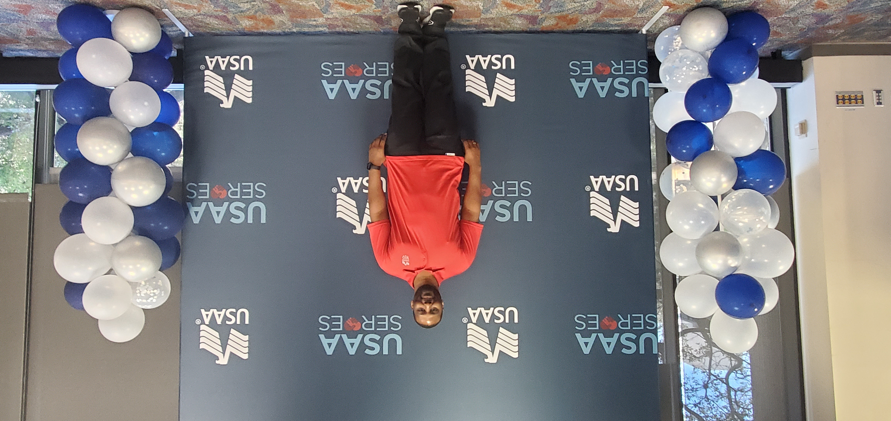

# module-challenge-02

## Description

module 2 is my portfolio so far in my bootcamp class.  as well as my professional career
the portfolio is equiped with pictures of my military life and my civilian life.  the links 
attached to the portfolio are the github pages for the current challenge as well as the previous 
challenges.  

## Installation

click the link to open app: https://github.com/AnthonyStrickland/module-challenge-02

## Usage

,(Assets/ArmyOCP.png),
(Assets/IMG_20130511_094937_444.jpg), (Assets/IMG_20130607_185240_289.jpg),(Assets/Screenshot 2023-08-26 094630.png)

## Credits
https://www.etsy.com/listing/1459316418/multicam-ocp-oem-camouflage-nylon-cotton?gpla=1&gao=1&&utm_source=google&utm_medium=cpc&utm_campaign=shopping_us_b-craft_supplies_and_tools-fabric_and_notions-fabric&utm_custom1=_k_Cj0KCQjw0bunBhD9ARIsAAZl0E2hyb7Lu3HrPpOMe6U-qQEWUvQI4IjptUxPV5bc001fktnstbTTLKsaAqSoEALw_wcB_k_&utm_content=go_1843970767_72373038440_346429184813_aud-2079782229574:pla-295916403786_c__1459316418_12768591&utm_custom2=1843970767&gclid=Cj0KCQjw0bunBhD9ARIsAAZl0E2hyb7Lu3HrPpOMe6U-qQEWUvQI4IjptUxPV5bc001fktnstbTTLKsaAqSoEALw_wcB

https://www.w3schools.com/html/html5_semantic_elements.asp

UTSA Bootcamp
